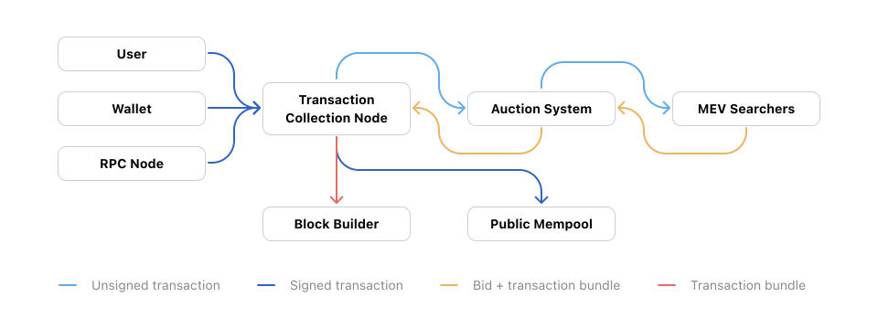

# MEV Marketplace

As the history of MEV shows, MEV solutions so far have been (and is planned to remain being) about rewarding miners and validators. Assuming public mempools, no other mitigation outcome is possible, as block proposers have ultimate power to publish new blocks, and therefore, extract MEV.

Infrastructure, both built so far and planned for the future, is about taming the potentially destructive Searcher behaviour, while acruing all value to block proposers.

Approaches to mitigate MEV at dapp design level have been successful, but are limited in scope, as users are required to use specific aggregators and dapps. These solutions are limited in scope, and have equally limited effect.

## Conceptual Introduction

We propose an auction system for blockchain transactions that commits to returning the vast majority of collected MEV revenue back to the user, effectively solving attributable MEV universally.

The system is achieved using:

- **Transaction collection node**, for instance, a custom blockchain node (a JSON-RPC proxy);
- **Private mempools** that initially only reveal unsigned transactions, until an auction is completed or expires;
- **Auction system** with direct connection to Searchers, running a blind auction for each transaction;
- **Accounting system** for tracking rewards for users, transaction providers and the marketplace itself;
- **Bundle publishing system** that publishes transaction bundles to block builders.

## Auction Process

The following diagram shows all system parts and the auction process steps:

The auction process, explained:

0. **Setup:** User either uses a Wallet that uses our JSON-RPC endoint, or sets up the endopoint manually.
1. **Transaction is made:** user submits the transaction normally, for example, performs a swap using Uniswap.
2. **Transaction is collected by our node:** all `eth_sendRawTransaction` requests, that would normally publish the transaction to the public mempool immediately, are captured by our JSON-RPC proxy and kept private temporarily.
3. **Transaction is forwarded for auction:** Transaction Collection Node removes the transaction signature and hands it over to the Auction System.
4. **Auction System runs the auction:** transaction is forwarded to all Searchers, and a timer begins.
5. **Searchers submit blind bids:** taking an unsigned transaction, and proposing full Flashbots-like Bundles and including their payment transaction.
6. **Auction ends:** after a timer expires, the bundle with the higest bid (if any) is selected, and forwarded to Transaction Collection Node.
7. **Fees are accounted:**
   - **Searcher rewards** are inherent in the bid itself: it's whatever value they can extract from a bundle, with blockchain basefees, minimal priority fees and bid amount subtracted.
   - **Auction System's rewards** are logged to the accounting system as a winning bundle is forwarded to the Transaction Collection Node
   - **Transaction Collection Node** and **User Rewards** are logged and sent to the accounting system by adding an additional transaction to the bundle.
8. **Transaction is published:** Signature is added back to the transaction, and published in one of two ways:
   - *If at least one bid has been received,* then the bundle is published to block builders, using same channels that Searchers use to submit bundles around public transactions.
   - *If no bids were received,* then the transaction is published to the public mempool. There, MEV might be extracted by public mempool Searchers. With enough diversity and competition between Searchers bidding in our system, only MEV-free transactions are likely to go to public mempools.

## Supply: Transaction Providers

Strong marketplaces begin with supply, and in this case, it is transactions submitted to our Transaction Collection Node. We can increase adoption across a couple of points along transaction journey:

- **Direct user adoption.** Some of our earliest users will likely begin using the markeplace by manually changing their wallet settings and using our JSON-RPC proxy to publish their transactions. This doesn't have to be a complex operation: MetaMask wallet allows adding a new RPC endpoint with just a couple clicks.
- **Wallet adoption.** We expect that most of our supply growth will come from wallet developers using our JSON-RPC endpoint to not only save on API costs, but also to additionally monetize their product. Many wallets are open-source and privacy-focused, limited their monetization opportunities. By using our node endpoint wallet developers can also set a fee percentage that will be allocated to a specified fee recipient.
- **Existing Node providers.** Existing JSON-RPC nodes can either forward their requests to our node, or maintain their own private mempools that interact with our Auction System. MEV revenue can subsidize node operation enough to make their services free.

## Demand: Searchers

## Chapter Summary