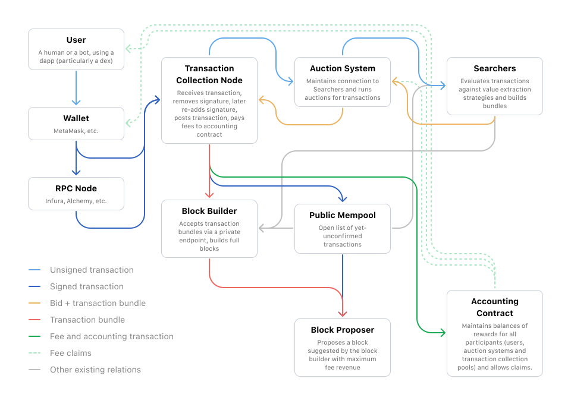

# Technical Implementation

This chapter will explore a possible MEV Marketplace technical implementation in great depth. For a higher level overview, see Auction Process section in the [MEV Marketplace](./mev-marketplace.md) chapter.

## System Components

The entire system can be split into a couple of separate components. Starting with components that would be directly maintained by MEV Marketplace developers, these are:

### Transaction Collection Node

This JSON-RPC-like node might act as a proxy to simplify adoption. Most JSON-RPC requests would be redirect to another JSON-RPC provider, excluding `eth_sendRawTransaction` requests (to capture new transactions) and `eth_getTransactionByHash` for requests about transactions that are currently being auctioned and are not yet visible in a public mempool or a block.

Transaction Collection Node is responsible for:

- Accepting new transactions with very high uptime and resilience.
- Handling all JSON-RPC requests, either directly or as a proxy.
- Removing transaction signatures and keeping them safe until after auctions conclude.
- Receiving winning bundles from auctions and reattaching transaction signatures.
- Submitting full bundles to the Block Builder.

### Auction System

Auction System can be a separate service, or part of a Transaction Collection Node. It is likely that initially these componoents will be developed as a single service, and split later.

Auction System runs auctions. After it receives a transaction from the Collection Node, it announces it to all connected Searchers and starts a timer. It then accepts bids from Searchers, expressed as a modified version of a Transaction Bundle with a bid attached. Searchers can submit multiple bids, overwriting their previous bids. Bidding is described in more detail in a later section.

When the timer expires, Auction system simply picks the highest bid and returns it back to Transaction Collection Node, that can re-attach signature and submit the transaction.

To maintain efficient communication with searchers, the connection with each searcher can use WebSockets protocol, maintaining real-time, two-way connection for sending messages. This protocol is more efficient than regularly asking the Auction System about new transactions ("polling").

#### Auctioning Multiple Transactions

It might be possible to extend the bidding and auction mechanism to allow Searchers to simultaneously bid on multiple transactions at a time. This is left for later system developments because such system would add complexity not only for the auction system, but also for accounting.

### Accounting Contract

An optional part of the system that would enable a fully trustless operation is an Accounting Contract, collecting and accounting for all rewards earned by different parties (transaction provider, collection node, auction system and the user).

Accounting Contract could be smart contract that accepts a special type of transaction, with value (ether) sent together with information how the value should be split.

Intially Accounting is likely to be done off-chain to optimise for transaction costs. It is also possible to run the Accounting Contract on a rollup, allowing for cheaper payments logging.

---

Other participants in the system are not directly maintained by MEV Marketplace developers, but are essential for overall ecosystem.

### Transaction Providers: Users, Wallets, Nodes

Returning rewards from MEV relies on exclusive access to transaction, therefore Transaction Providers are key to the system. Transaction can be sent by the user manually, or users can join MEV Marketplace without even knowing, via a partnership with a wallet or a node provider.

#### Users

Users can enter the MEV Marketplace ecosystem manually by overwriting their RPC settings and pointing it to our Transaction Collection Node, that acts as a JSON-RPC endpoint. This is supported by many wallets, including MetaMask. For MetaMask in particular adding a new RPC endpoint can be as easy as two clicks. Additionally, with the availability of MetaMask Snaps, it would be possible to develop a plugin that would adjust the settings automatically.

We expect that individual user onboarding will be an initially important, but slow and eventually non-scalable process.

#### Wallets

The best transaction provider overall, and our main growth target, are wallets. Wallets formulate transactions that will be sent to the network, and they use JSON-RPC endpoints to deliver the transaction to the Ethereum network. Partnerships with wallets would allow us to transparently onboard thousands of users.

Additionally, as the main interface used by the user, wallet partnerships would be key to communicating to the user their earned rewards and methods of claiming them. Each MEV Rewards earning transaction could be annotated with an additional message about rewards right in the wallet interface.

#### Nodes

JSON-RPC nodes are the final stop before a transaction gets to the mempool, and might be the most scalable way of onboarding very large number of transactions. However, Nodes have a couple of downsides:

- Node providers might have a contractual agreement, or at least an expectation, to be neutral and simply deliver on a technical requirement, to deliver transactions straight to the blockchain network. Introducing auction-related delay might betray this expectation.
- Nodes are just an API endpoint, and therefore do not provide any way of communicating information back to the user, such as amount of rewards earned.

### Searchers

The amount of value returned to the MEV Marketplace (to be split between the system, transaction provider and the user) will depend mostly on the amount of competition between MEV Searchers. This can be observed even in the current structure of MEV extraction: types of MEV with most Searchers have most competition, returning up to 95% of the value to the miner; types of MEV with just a few Searchers have little competition, and Searchers can keep 80% or more of the value extracted.

Attracting Searchers to MEV Marketplace ecosystem will be key to ensuring high percentage of value returned to the user and other participants. For the technical implemetation perspective, this can achieved by maximising compatibility with existing Searchers code.

Currently Searchers are used to scanning the mempool for transactions, and format their bids as Bundles, with the gas price being the bid amount. MEV Marketplace has to work slightly differently, but over time we can work on minimizing these differences:

- MEV Marketplace transactions would not require scanning the mempool, and new transactions would be sent to searchers directly. This is likely to be a code reduction on Searchers side, and a mempool-compatibility layer can be added on Searcher's side.
- MEV Marketplace transactions don't aim to reward miners, and gas price is a signed part of a transaction, so Searchers would need to modify their bidding algorithms to formulate the bid directly, as a value amount, instead of calculating the gas price bid. This again is likely to be a code reduction on Searchers side, but it might not be possible to add any simple compatibility layers.

### Block Builders

## Auction Process

### Transaction Blinding

### Bidding Format

#### Trusted Approach

#### Trustless Approach

## Transaction Bundle Structure

## Alternatives to the Auction Process

## Separation of Concerns and Decentralization

## Chapter Summary
